# 🏥 Medical Diagnosis System

An AI-based application that predicts possible diseases from user-provided symptoms. It uses a **Bayesian Network** for probabilistic reasoning and **Neo4j** as a graph database for medical knowledge storage and querying.

This is an academic mini-project demonstrating Artificial Intelligence techniques — especially Bayesian inference — in healthcare decision-making.

---

## 📖 Overview

The Medical Diagnosis System ingests a hand-curated medical knowledge base, stores symptom–disease relationships in a Neo4j graph, then applies Bayesian inference to rank candidate diseases given a patient's observed symptoms.

Rather than returning a single "answer," the system returns a **top-k ranked list of diseases with posterior probabilities**, which is a more honest representation of what probabilistic reasoning can (and cannot) tell us.

---

## 🎯 Objectives

- Model medical diagnosis using probabilistic reasoning.
- Handle uncertainty in symptom–disease relationships.
- Store medical knowledge using a graph-based approach.
- Provide accurate disease predictions based on symptoms.

---

## 🧠 Key Technologies

- **Python 3.10+**
- **Bayesian Networks** (`pgmpy`)
- **Neo4j** Graph Database
- **spaCy** for basic NLP processing
- Graph-based knowledge representation

---

## 📂 Project Structure

```
Medical-Diagnosis-System/
├── app/
│   ├── main.py                # Main application entry point
│   ├── bayesian.py            # Bayesian Network implementation
│   ├── knowledge_loader.py    # Loads medical knowledge into Neo4j
│   ├── knowledge_query.py     # Queries disease-symptom relationships
│   ├── nlp_loader.py          # Processes symptom text input
│   └── __init__.py
│
├── db/
│   └── connection.py          # Neo4j database connection
│
├── knowledge.txt              # Medical knowledge base (CPT source)
├── knowledge-graph.png        # Knowledge graph visualization
├── knowledge-graph-2.png
├── requirements.txt           # Python dependencies
└── README.md
```

---

## ⚙️ How the System Works

```mermaid
flowchart TD
    A[knowledge.txt] -->|nlp_loader.py| B[Neo4j Graph DB]
    B -->|disease + P symtom&#124;disease| C[build_dynamic_bn]
    U[User symptoms] -->|nlp_loader.py| P[Parsed symptom dict]
    P --> C
    C --> D[Bayesian Network]
    D -->|VariableElimination| E[Posterior P Disease&#124;Symptoms]
    E --> R[Top-k ranked diseases]
```



1. **Knowledge ingestion** — `knowledge.txt` is parsed by `nlp_loader.py` and written to Neo4j as `(Disease)-[:CAUSES {probability: p}]->(Symptom)` relationships.
2. **User input** — symptoms are parsed into a `{symptom_name: 0|1}` observation dict.
3. **Reasoning** — `bayesian.py` builds a `DiscreteBayesianNetwork` from the graph and runs **Variable Elimination** to compute `P(Disease | Symptoms)`.
4. **Output** — diseases are returned sorted by posterior probability (top-k).

---

## 🧮 Algorithm

**Bayesian Network** with **Variable Elimination** inference.

- Handles uncertainty in medical diagnosis via conditional probabilities.
- Computes the posterior probability of each disease given observed symptoms:

```
P(Disease | Symptoms) ∝ P(Symptoms | Disease) · P(Disease)
```

- **Why variable elimination?** It avoids computing the full joint distribution, which would be intractable for dozens of symptoms. The graph structure (symptoms → disease) keeps inference efficient.

---

## 📚 Knowledge Base Format (`knowledge.txt`)

The knowledge file is a flat, line-based list. Each line is one disease and its associated symptoms, with a uniform default probability (`0.8`) assigned to every `(disease, symptom)` edge at load time:

```
Disease has symptoms Symptom A, Symptom B, Symptom C.
```

**Format:** `<Disease> has symptoms <Symptom 1>, <Symptom 2>, ..., <Symptom N>.`

**Example (first 3 lines of `knowledge.txt`):**

```
Flu has symptoms Fever, Cough, Headache, Body Aches.
Common Cold has symptoms Sneezing, Runny Nose, Sore Throat.
COVID-19 has symptoms Fever, Cough, Shortness of Breath, Loss of Taste.
```

These probabilities are hand-authored and are the **only** source of the conditional probability tables. They are not learned from data. See the Limitations section below.

---

## 🚀 How to Run

### 1. Install dependencies

```bash
pip install -r requirements.txt
python -m spacy download en_core_web_sm
```

### 2. Set up Neo4j

- Install [Neo4j Desktop](https://neo4j.com/download/) (or use Docker).
- Start a local database on `bolt://localhost:7687`.
- Update credentials in `db/connection.py` (or set `NEO4J_URI`, `NEO4J_USER`, `NEO4J_PASSWORD` env vars and uncomment the env-var lines in that file).

### 3. Load the knowledge base

```bash
python app/main.py
```

`main.py` will:

1. Load `knowledge.txt` into Neo4j (Step 1 in the output).
2. Run a built-in diagnosis example (Step 2).
3. Query Neo4j for diseases matching a sample symptom list (Step 3).

### 4. Sample I/O

**Input** (from `app/main.py`):

```python
observed = {
    "Fever": 1,
    "Cough": 1,
    "Shortness of Breath": 0
}
```

**Output:**

```
Ranked Diseases based on observed symptoms:
COVID-19: 0.64
Flu: 0.51
Pneumonia: 0.42
Bronchitis: 0.31
...
```

(Exact numbers depend on the probability values in your `knowledge.txt`.)

---

## 🛠 Edge-Case Behavior

| Scenario | Behavior |
|---|---|
| **Empty user input** | `extract_entities_and_relationship` returns `(None, [])`; diagnosis is skipped with a warning printed. |
| **Unknown symptom** (not in graph) | `pgmpy` will raise on the evidence variable; `perform_inference` catches the exception per disease and skips it. The unknown symptom is silently dropped from evidence. |
| **No disease matches observed symptoms** | The ranked list is empty; the user sees no candidates. |
| **Neo4j unreachable** | The Neo4j driver raises a `ServiceUnavailable` / `AuthError` on the first session call. This propagates to `main.py` and the script exits. Wrap calls in `try/except` if you want graceful degradation. |
| **Malformed `knowledge.txt` line** | `line.split(" has symptoms ")` will raise `ValueError`. The line is currently not caught — keep the file clean. |
| **Duplicate symptom in input** | Harmless — the last value wins in the dict. |

---

## 📊 Features

- Probabilistic disease prediction (posterior `P(Disease | Symptoms)`).
- Knowledge-based reasoning over a Neo4j graph.
- Graph visualization of medical data (see `knowledge-graph.png`).
- Modular, well-structured code.
- Returns top-k ranked candidates rather than a single guess.

---

## ⚠️ Limitations & Disclaimer

**This project is for academic and educational purposes only. It is NOT a medical device and must NOT be used for clinical decision-making.**

Specific limitations:

- **Probabilities are hand-authored.** All `(symptom, disease)` conditional probabilities default to `0.8` at load time. They are not estimated from clinical data and should not be interpreted as medically accurate.
- **Naïve Bayes-style independence assumption.** The current BN assumes symptoms are conditionally independent given a disease. Real diseases have correlated symptoms (e.g. fever + chills are not independent given flu).
- **Tiny, fixed knowledge base.** `knowledge.txt` covers ~75 common conditions. Anything outside the file is unknown to the system.
- **No symptom synonym handling.** "High fever" will not match "Fever" unless the input exactly matches a symptom name in the graph.
- **No prior probabilities.** `P(Disease)` is implicitly uniform across all diseases in the graph.
- **No learning from data.** The system is fully knowledge-driven; it does not update probabilities from patient outcomes.

Use the system to learn about Bayesian inference and graph databases — not to diagnose anyone.

---

## 🎓 Academic Use

This project is ideal for:

- AI / Machine Learning courses
- Bayesian Network demonstrations
- Healthcare decision-support studies
- University mini or semester projects

---

## 👨‍💻 Author

**M. Rafay Bukhari**
BS Computer Science
COMSATS University Lahore


<!-- Testing custom skills -->